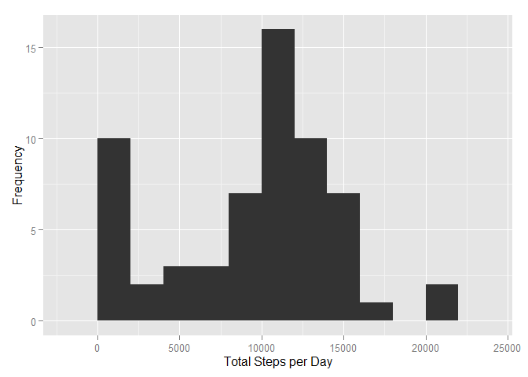
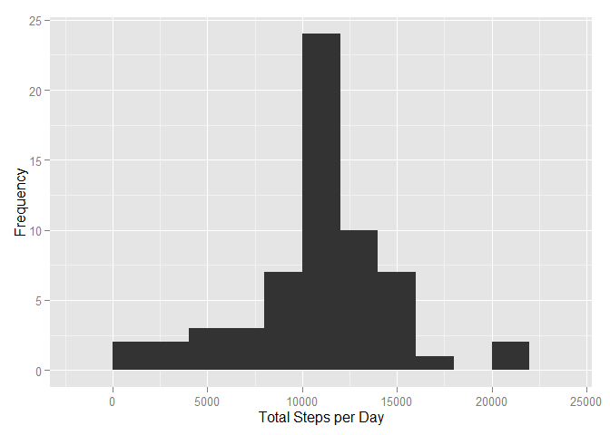
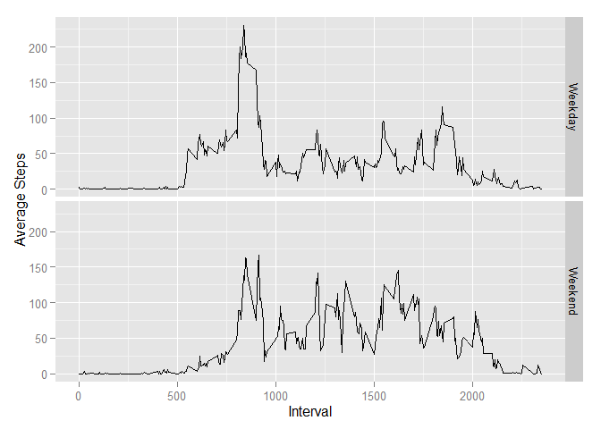

# Reproducible Research: Peer Assessment 1


**Introduction**
============

It is now possible to collect a large amount of data about personal movement using activity monitoring devices such as a Fitbit, Nike Fuelband, or Jawbone Up. These type of devices are part of the "quantified self" movement - a group of enthusiasts who take measurements about themselves regularly to improve their health, to find patterns in their behavior, or because they are tech geeks. But these data remain under-utilized both because the raw data are hard to obtain and there is a lack of statistical methods and software for processing and interpreting the data.

This assignment makes use of data from a personal activity monitoring device. This device collects data at 5 minute intervals through out the day. The data consists of two months of data from an anonymous individual collected during the months of October and November, 2012 and include the number of steps taken in 5 minute intervals each day.


## Loading and preprocessing the data

Load the R packages to be used.


```r
library(dplyr)
```

```
## 
## Attaching package: 'dplyr'
## 
## The following objects are masked from 'package:stats':
## 
##     filter, lag
## 
## The following objects are masked from 'package:base':
## 
##     intersect, setdiff, setequal, union
```

```r
library(ggplot2)
```

First we need to read and assess the structure of the data. We can observe that the data type
of the date variable is undesirable.


```r
data<-read.csv("./data/activity.csv")
str(data)
```

```
## 'data.frame':	17568 obs. of  3 variables:
##  $ steps   : int  NA NA NA NA NA NA NA NA NA NA ...
##  $ date    : Factor w/ 61 levels "2012-10-01","2012-10-02",..: 1 1 1 1 1 1 1 1 1 1 ...
##  $ interval: int  0 5 10 15 20 25 30 35 40 45 ...
```

Naturally, a proper date conversion is needed. Now the data are *cleaned*. 


```r
data$date<-as.Date(data$date,"%Y-%m-%d")
str(data)
```

```
## 'data.frame':	17568 obs. of  3 variables:
##  $ steps   : int  NA NA NA NA NA NA NA NA NA NA ...
##  $ date    : Date, format: "2012-10-01" "2012-10-01" ...
##  $ interval: int  0 5 10 15 20 25 30 35 40 45 ...
```


## What is mean total number of steps taken per day?

We use the dplyr package and construct the respective pivot table.


```r
aggregate_date<-data %>%
            group_by(date) %>%
            summarize(total_steps_d=sum(steps,na.rm = TRUE),
                      avg_steps_d=mean(steps,na.rm = TRUE)) 
```

For exploratory purposes, we deploy a simple histogram. 


```r
qplot(total_steps_d,data=aggregate_date,geom="histogram",binwidth=2000,xlab = "Total Steps per Day",ylab = "Frequency")
```

 

From there we can observe a dense frequency between 10,000 and 15,000 steps. 
Let's take a look at the key measures of central tendency: mean and median.

In terms of both total and average steps:


```r
summary(aggregate_date$total_steps_d)
```

```
##    Min. 1st Qu.  Median    Mean 3rd Qu.    Max. 
##       0    6778   10400    9354   12810   21190
```

```r
summary(aggregate_date$avg_steps_d)
```

```
##    Min. 1st Qu.  Median    Mean 3rd Qu.    Max.    NA's 
##  0.1424 30.7000 37.3800 37.3800 46.1600 73.5900       8
```

There exists a slight skewness to the left, due to left bin which is proximate to zero.
Note that the mean and median of the average steps coincide.


## What is the average daily activity pattern?

We use the dplyr package to construct the respective pivot table.
Then we visualize with a simple line plot: Average Number of steps vs Interval identifier.


```r
aggregate_interval<-data %>%
        group_by(interval) %>%
        summarize(avg_steps_d=mean(steps,na.rm = TRUE))  

qplot(x =interval,y = avg_steps_d,data=aggregate_interval,geom="line",xlab = "Interval",ylab = "Average Number of Steps")
```

 

The line plot depicts a substantial amount of steps between intervals 500 and 1000. The maximum number of steps,
on average across all days in the dataset are 206 and correspond to interval 835, as shown below. 


```r
max_step<-max(aggregate_interval$avg_steps_d)
subset(x = aggregate_interval,avg_steps_d==max_step)
```

```
## Source: local data frame [1 x 2]
## 
##   interval avg_steps_d
##      (int)       (dbl)
## 1      835    206.1698
```

## Imputing missing values

Initially, by viewing the structure of the dataset we observe a lot of missing values. Let's find how many.


```r
nas<-sum(is.na(data$steps))
sum(is.na(data$interval))
```

```
## [1] 0
```

```r
avg_na<-nas/nrow(data)
signif(avg_na,2)
```

```
## [1] 0.13
```

From the 2 data subsets created above, we can see that 8 observations of the average steps per day variable 
are also missing. Therefore, to fill the missing values in the dataset, we will rely on the daily average steps
per interval identifier (second data subset).

Let's first make a copy of the existing data.


```r
data2<-data
```

To calculate the mean and median steps per date, we must first replace the NAs with values. We will replace the 
the missing values of the original dataset with the mean of the corresponding 5-minute average (interval). We deploy a for-next loop, matching the mean step value of the interval that each NA belongs:


```r
cnt<-nrow(data2)

for (i in 1:cnt) {
        if (is.na(data2$steps[i])) {
                fillval<- subset(aggregate_interval, interval==data2$interval[i])
                data2$steps[i] <- fillval$avg_steps_d
        }
}
```

Check that no NAs exist in our clean dataset.


```r
table(is.na(data2$steps))
```

```
## 
## FALSE 
## 17568
```

Re-run the histogram.


```r
aggregate_date_clean<-data2 %>%
        group_by(date) %>%
        summarize(total_steps_d=sum(steps,na.rm = TRUE),
                  avg_steps_d=mean(steps,na.rm = TRUE))        

qplot(total_steps_d,data=aggregate_date_clean,geom="histogram",binwidth=2000,xlab = "Total Steps per Day",ylab = "Frequency")
```

 

```r
summary(aggregate_date_clean$total_steps_d)
```

```
##    Min. 1st Qu.  Median    Mean 3rd Qu.    Max. 
##      41    9819   10770   10770   12810   21190
```

One can observe the following:

+ Symmnetrically distribution of total steps/day (Mean=Median)
+ Our replacement now fill the range of [10000-15000] steps
+ Decrease in the range of results


## Are there differences in activity patterns between weekdays and weekends?

Different week-periods are due to lead to different exercise patterns. We will use the suggested **weekdays()** function to split the dataset in two subsets, then a construct the respective pivots per period tag.


```r
data2$day <- ifelse(weekdays(data2$date) %in% c("Saturday", "Sunday"), "weekend", "weekday")
table(data2$day)
```

```
## 
## weekday weekend 
##   12960    4608
```

```r
data_wkday<-filter(data2,day=="weekday") ;data_wkend<-filter(data2,day=="weekend")

x<-data_wkday %>%
        group_by(interval) %>%
        summarize(avg_steps=mean(steps))
x$day<-"Weekday"

y<-data_wkend %>%
        group_by(interval) %>%
        summarize(avg_steps=mean(steps))
y$day<-"Weekend"
```


To make a panel plot, first we need factor variables.


```r
z<-bind_rows(x,y)
str(z)
```

```
## Classes 'tbl_df', 'tbl' and 'data.frame':	576 obs. of  3 variables:
##  $ interval : int  0 5 10 15 20 25 30 35 40 45 ...
##  $ avg_steps: num  2.251 0.445 0.173 0.198 0.099 ...
##  $ day      : chr  "Weekday" "Weekday" "Weekday" "Weekday" ...
```

```r
z$day<-as.factor(z$day)
str(z)
```

```
## Classes 'tbl_df', 'tbl' and 'data.frame':	576 obs. of  3 variables:
##  $ interval : int  0 5 10 15 20 25 30 35 40 45 ...
##  $ avg_steps: num  2.251 0.445 0.173 0.198 0.099 ...
##  $ day      : Factor w/ 2 levels "Weekday","Weekend": 1 1 1 1 1 1 1 1 1 1 ...
```

Then the time series plot per type of day.

```r
qplot(x = interval,y = avg_steps,data=z,geom="line",facets = day~.,xlab = "Interval",ylab="Average Steps")
```

 

Conclusions:

+ During weekdays, we see higher activity during the early hours of the day, followed by an expected winding-down.
+ During weekends, the early-hour activity is comparatively lower. However, during the rest of the timeframe, activity frequently surpasses the 100-step barrier (contrary to weekdays) and seems much more evenly distributed across the day.


